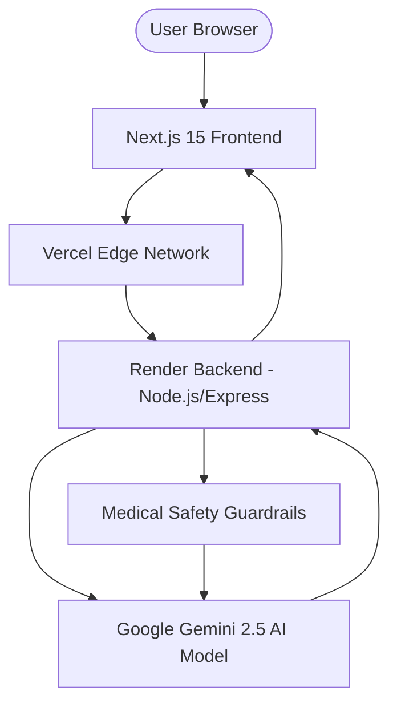
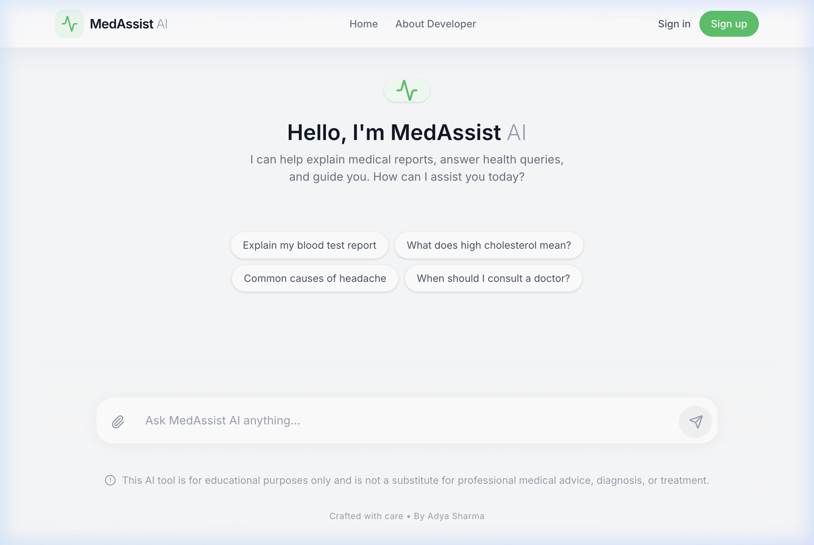
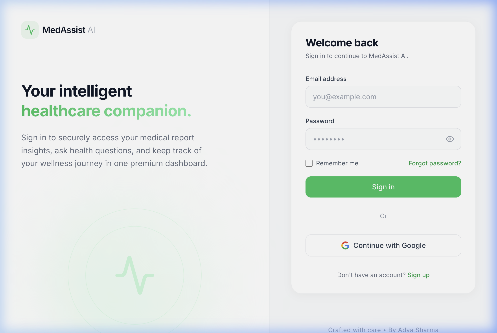
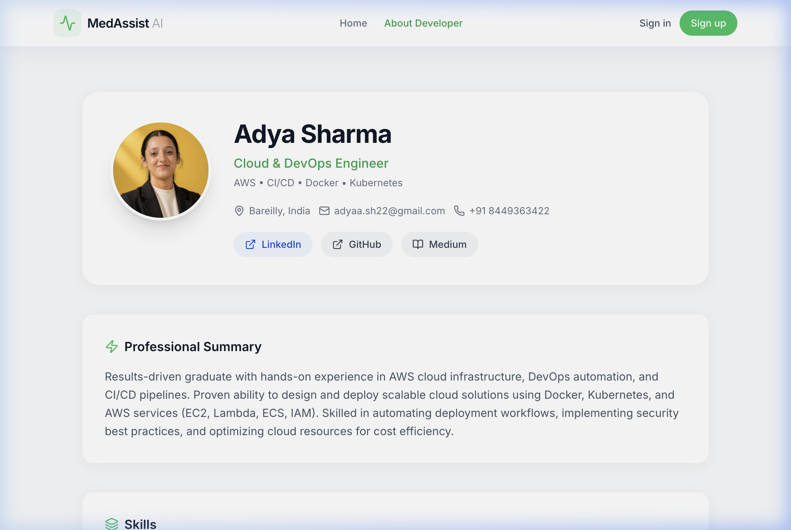

# 🏥 MedAssist AI — Your Intelligent Healthcare Companion

MedAssist AI is a premium, full-stack AI healthcare assistant designed to provide intelligent medical report analysis, wellness guidance, and quick health query responses. Built with a focus on **privacy, security, and medical safety guardrails**, it delivers professional-grade insights in a minimal, high-end interface.

🚀 **Live Demo:** [https://medassist-ai-iota.vercel.app](https://medassist-ai-iota.vercel.app)

---

## 🏗️ Project Architecture



---

## ✨ Key Features

### 🧠 Intelligent Health Assistant
Experience high-context conversations with an AI specifically tuned for healthcare guidance. The system maintains conversation history to provide relevant, multi-turn assistance.

### 📄 Automated Medical Report Analysis
Upload complex lab results (CBC, Lipid Profile, etc.) and receive a structured breakdown that explains medical jargon in plain English while highlighting critical values.

### 🛡️ Enterprise-Grade Safety
- **Non-Diagnostic AI:** The system is strictly tuned to avoid making diagnoses or prescriptions.
- **Automated Disclaimers:** Every response is paired with a medical advisory.
- **Data Privacy:** Secure handling of uploaded documents via memory buffers (no persistent file storage).

### 🔐 Modern Authentication System
- **Next.js Server Components:** Optimized for performance and SEO.
- **Live Validation:** Real-time feedback on password strength and email format.
- **Glassmorphic Design:** A state-of-the-art UI system built with Tailwind CSS.

---

## 🛠️ Tech Stack

**Frontend:**
- **Next.js 15+ (App Router)**
- **Tailwind CSS**
- **Framer Motion** (Smooth Animations)
- **Lucide React** (Premium Icons)

**Backend:**
- **Node.js & Express**
- **Google Gemini 2.5 Flash API**
- **Multer** (File Handling)
- **CORS & Dotenv**

---

## 📸 Screenshots

### 🖥️ Modern & Minimalist Interface

| Home / Chat Interface | Premium Login Experience |
|:---:|:---:|
|  |  |

| Developer Profile Section |
|:---:|
|  |

---

## 👩‍💻 Developed By

**Adya Sharma**  
*Cloud & DevOps Engineer*

- **LinkedIn:** [adya-sharma-403124251](https://linkedin.com/in/adya-sharma-403124251)
- **GitHub:** [@adya-hub](https://github.com/adya-hub)
- **Email:** adyaa.sh22@gmail.com

---

## 🚀 Getting Started

### Prerequisites
- Node.js installed
- Google Gemini API Key

### Installation

1. **Clone the repository:**
   ```bash
   git clone https://github.com/adya-hub/medassist-ai.git
   cd medassist-ai
   ```

2. **Setup Backend:**
   ```bash
   cd backend
   npm install
   # Create a .env file and add:
   # API_KEY=your_gemini_key
   # PORT=5001
   npm start
   ```

3. **Setup Frontend:**
   ```bash
   cd ../medassist-ai
   npm install
   npm run dev
   ```

---

## ⚖️ Disclaimer
*MedAssist AI is for educational purposes only. It is NOT a substitute for professional medical advice, diagnosis, or treatment. Always seek the advice of your physician or other qualified health provider with any questions you may have regarding a medical condition.*

---
Crafted with care &bull; By Adya Sharma
